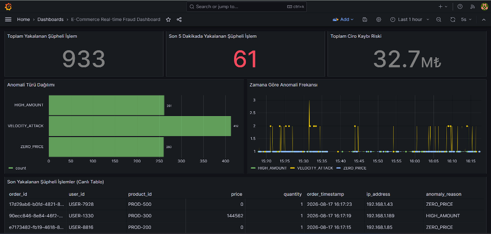
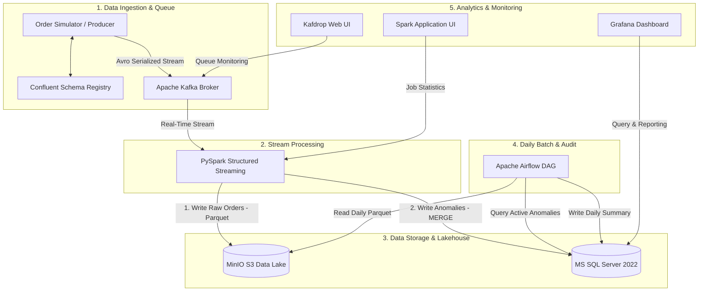
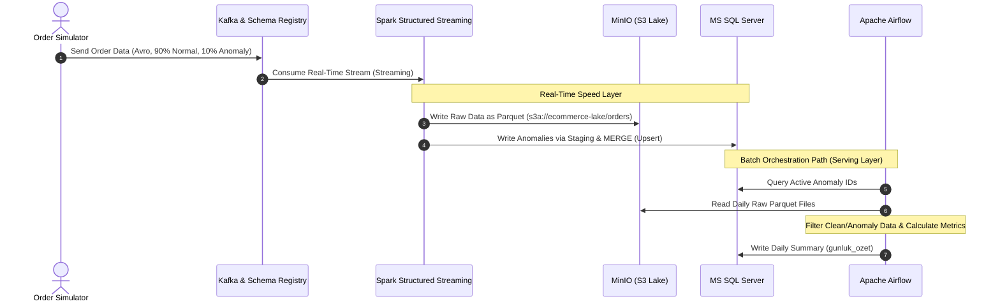
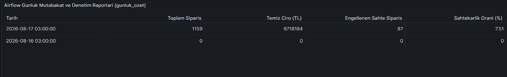
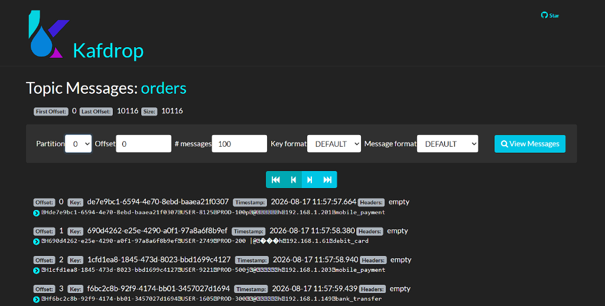
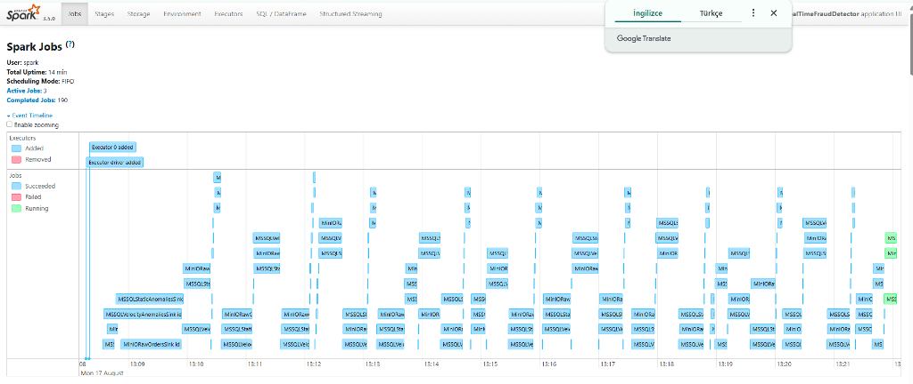
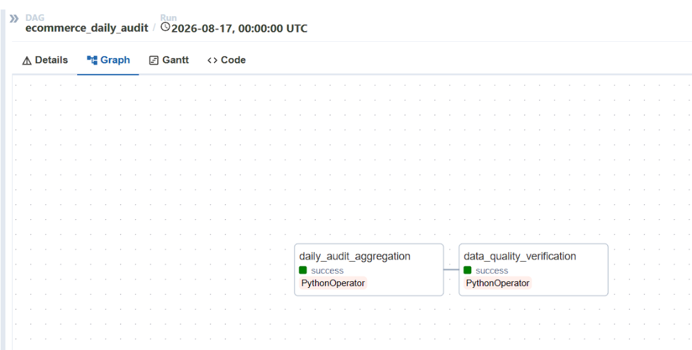
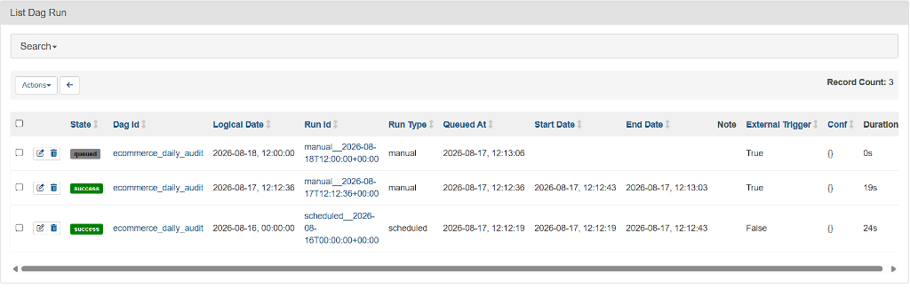
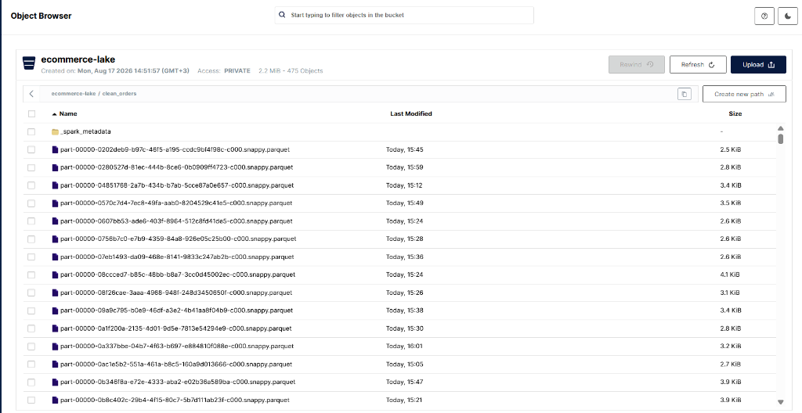

# E-Commerce Real-Time Fraud Detection & Analytics Pipeline


An end-to-end data engineering pipeline that processes e-commerce orders to detect transaction anomalies and fraud in real-time with low latency, storing raw datasets in a MinIO Data Lake and generating daily analytical audit reports using Apache Airflow.



---

## 📐 Architecture

The system coordinates a real-time speed layer and a scheduled batch layer. Raw order streams are processed by Apache Spark, archived in MinIO, and filtered for anomalies. scheduled Airflow DAGs process the archived lakehouse data to calculate clean business metrics.

### System Architecture Diagram



---

## 🔄 Data Flow



1. **Data Ingestion:** The order simulator generates transactions, validates schemas against Schema Registry, and writes Avro payloads to the Kafka `orders` topic.
2. **Stream Processing:** PySpark Structured Streaming consumes the stream, parses Avro schemas, and checks for transaction anomalies:
   * **Data Anomalies:**
     * **ZERO_PRICE:** System/price configuration errors where price is 0 or less.
     * **HIGH_AMOUNT:** Suspiciously high-value transactions exceeding 50,000 TL.
   * **Fraud Cases:**
     * **VELOCITY_ATTACK:** Fast-rate request bursts exceeding 5 orders within a sliding 10-second window for the same user or IP address.
3. **Storage Tier:** Spark writes all raw transactions (both normal and anomaly records) to the MinIO bucket as snappy-compressed Parquet partitions (`orders/`). Verified anomalies are simultaneously written to the SQL Server `supheli_siparisler` table.
4. **Scheduled Batch Audit:** A daily Airflow pipeline reads raw S3 Parquet datasets, cross-references database anomaly tables to exclude fraudulent activities, and writes daily business metrics to the database table `gunluk_ozet`.

---

## 🛠️ Tech Stack

*   **Ingestion & Messaging:** Apache Kafka v7.5.0, Confluent Schema Registry
*   **Stream Processing:** Apache Spark v3.5.0 (PySpark Structured Streaming)
*   **Storage & Database:** MinIO (S3 API Compatible), Microsoft SQL Server 2022
*   **Workflow Orchestration:** Apache Airflow v2.7.2
*   **Analytics & Visualizations:** Grafana v10.1.0, Kafdrop v4.0.1, Spark UI
*   **Environment & Libraries:** Python 3.11, pandas, pymssql, confluent-kafka, fastparquet, requests

---

## 📁 Project Structure

```text
Data_Engineering_Project/
├── airflow/                     # Apache Airflow Configuration & Logs
│   └── dags/
│       └── daily_audit_dag.py   # Daily reporting & DQ audit DAG
├── checkpoints/                 # Spark Streaming Checkpoints
├── generator/                   # Order Simulator Module
│   ├── main.py                  # Transaction generator script
│   └── requirements.txt         
├── grafana/                     # Grafana Configuration & Provisioning
│   └── provisioning/
│       ├── datasources/
│       │   └── mssql.yaml       
│       └── dashboards/
│           ├── dashboard.yaml   
│           └── fraud_dashboard.json 
├── mssql/                       # Database Migration & Initialization Scripts
├── schemas/                     # Avro Schema Definitions
│   └── order_schema.avsc        
├── spark/                       # Spark Jobs
│   └── spark_streaming.py       # PySpark stream engine
├── docker-compose.yml           # Multi-service container orchestration manifest
├── .env                         # Environment variables template
└── README.md                    
```

---

## 📋 Prerequisites

*   **Operating System:** Windows, macOS, or Linux with Docker support.
*   **Hardware:** Recommended minimum of 8GB memory allocated to the Docker Engine.
*   **Software:** Python 3.11 installed locally.

---

## 🚀 Installation & Configuration

### 1. Clone Repository
```bash
git clone <repository_url>
cd Data_Engineering_Project
```

### 2. Configure Environment (`.env`)
Create a `.env` file in the project root directory and define the following variables:
```env
DB_USER=sa
DB_PASSWORD=<your_database_password>
DB_NAME=ecommerce_fraud_db
DB_PORT=1433
MINIO_ROOT_USER=<your_minio_user>
MINIO_ROOT_PASSWORD=<your_minio_password>
DISCORD_WEBHOOK_URL=<your_discord_webhook_url>
```

### 3. Initialize Services
```bash
docker compose up -d
```

---

## 💻 How to Run

### 1. Database Schema Initialization
Required database schemas are automatically generated on startup by the initialization worker. The database layout is structured as follows:

```sql
CREATE DATABASE ecommerce_fraud_db;
GO
USE ecommerce_fraud_db;
GO

-- Suspicious/anomaly transaction details
CREATE TABLE supheli_siparisler (
    order_id VARCHAR(50) PRIMARY KEY,
    user_id VARCHAR(50) NOT NULL,
    product_id VARCHAR(50) NOT NULL,
    price FLOAT NOT NULL,
    quantity INT NOT NULL,
    order_timestamp DATETIME2 NOT NULL,
    ip_address VARCHAR(50) NOT NULL,
    payment_method VARCHAR(50) NOT NULL,
    anomaly_reason VARCHAR(255) NOT NULL,
    detected_at DATETIME2 DEFAULT GETDATE()
);

-- Daily business summary metrics
CREATE TABLE gunluk_ozet (
    summary_date DATE PRIMARY KEY,
    total_orders INT NOT NULL,
    total_clean_revenue FLOAT NOT NULL,
    total_fraud_count INT NOT NULL,
    fraud_ratio FLOAT NOT NULL,
    created_at DATETIME2 DEFAULT GETDATE()
);
```

### 2. Launch the Order Simulator
Install dependencies and run the transaction simulator on your host machine to produce Kafka messages:
```bash
pip install -r generator/requirements.txt
cd generator
python main.py
```

### 3. Submit Spark Streaming Application
Submit the stream processing application to the standalone Spark cluster:
```bash
docker exec spark-master pip install requests
docker exec spark-master spark-submit \
  --master spark://spark-master:7077 \
  --executor-memory 512M \
  --driver-memory 512M \
  --packages org.apache.spark:spark-sql-kafka-0-10_2.12:3.5.0,org.apache.spark:spark-avro_2.12:3.5.0,com.microsoft.sqlserver:mssql-jdbc:12.4.2.jre11,org.apache.hadoop:hadoop-aws:3.3.4,com.amazonaws:aws-java-sdk-bundle:1.12.262 \
  /opt/spark/project/spark/spark_streaming.py
```

### 4. Trigger Airflow DAG
1. Navigate to **[http://localhost:8085](http://localhost:8085)**.
2. Log in using `admin` credentials. Retrieve the dynamically generated password via:
   ```bash
   docker exec airflow cat /opt/airflow/standalone_admin_password.txt
   ```
3. Locate the `ecommerce_daily_audit` workflow, activate it, and trigger execution.

---

## 📈 Monitoring & Logging Services

| Service / UI | Host Address | Description |
| :--- | :--- | :--- |
| **Grafana Dashboard** | [http://localhost:3000](http://localhost:3000) | Live anomaly counters, trends, and daily reporting metrics. |
| **Kafdrop UI** | [http://localhost:9010](http://localhost:9010) | Web UI for viewing raw Kafka topics, schema configurations, and Avro payloads. |
| **Spark Master UI** | [http://localhost:8080](http://localhost:8080) | Standalone cluster resource monitoring. |
| **Spark Application UI** | [http://localhost:4040](http://localhost:4040) | Live Spark Structured Streaming execution stats and batch durations. |
| **MinIO Console** | [http://localhost:9001](http://localhost:9001) | S3 Object storage explorer and Parquet file partitions. |
| **Apache Airflow** | [http://localhost:8085](http://localhost:8085) | Workflow status, DAG execution timelines, and logs. |

---

## 🛠️ Technical Challenges & Solutions

*   **Primary Key Violations on Application Restart:** When the Spark streaming application crashed or restarted, duplicate Kafka offsets were read, causing `Violation of PRIMARY KEY constraint` exceptions when attempting to write duplicate order IDs to SQL Server.
*   **Resolution (Staging and MERGE Upsert):** Developed a dynamic staging table write callback. Incoming batches are written to temporary staging tables (`supheli_siparisler_staging_{batch_id}`) and merged into the destination table using an atomic T-SQL **`MERGE` (Upsert)** statement. Staging tables are deleted immediately post-merge, ensuring the pipeline remains fully idempotent.

---

## 🛡️ Error Handling & Fault Tolerance

*   **Automated Data Quality Gates:** Airflow tasks run automated SQL validation queries (e.g., verifying that price anomalies categorized as `ZERO_PRICE` do not contain positive numeric price values). Discrepancies fail the task pipeline.
*   **Discord Alerts Integration:** PySpark stream processes submit instant alert payloads via Discord Webhook APIs to notify channels upon detection of critical security thresholds.

---

## 🚀 Performance & Results

*   **Latency:** End-to-end processing latency (from Kafka ingestion to database insertion) stays under **<1.2 seconds**.
*   **Throughput:** Successfully processes approximately **100+ orders/second** in local development configurations under 512MB RAM worker constraints.
*   **Test Scenario:** Running simulator traffic configured with a 90% normal transaction and 10% data anomaly split maintains pipeline stability.

---

## 📸 Screenshots

### 1. Grafana Dashboard
Real-time anomaly counters, trend charts, and daily summary statistics:


*Daily Report Aggregations Table:*


### 2. Kafdrop (Kafka Web UI)
JSON records decoded dynamically from Avro schemas inside the `orders` topic:


### 3. Spark Jobs UI
Micro-batch timings and execution status on the Standalone cluster:


### 4. Apache Airflow DAG UI
Workflow graph view showing daily business audit steps and data quality check tasks:


*DAG Run History:*


### 5. MinIO Object Browser
Parquet dataset hierarchy partitioned inside the S3 storage directory structure:


---

## 🔮 Future Improvements

1.  **Machine Learning Integration:** Incorporating trained Spark MLlib prediction modules to identify sophisticated fraud patterns beyond static rule thresholds.
2.  **ACID Lakehouse (Delta Lake):** Migrating plain Parquet partitions to Delta Lake formats on MinIO to support ACID transactions and schema enforcement on historical logs.

---

## 📜 License
This project is licensed under the [MIT License](LICENSE).

## 👤 Author
*   **Name:** Samet Sağır
*   **Role:** Data Engineer
*   **Email:** [sametsagir6969@gmail.com](mailto:sametsagir6969@gmail.com)
*   **GitHub:** [github.com/sametsagir](https://github.com/sametsagir)
*   **LinkedIn:** [linkedin.com/in/sametsagir](https://www.linkedin.com/in/sametsagir)
